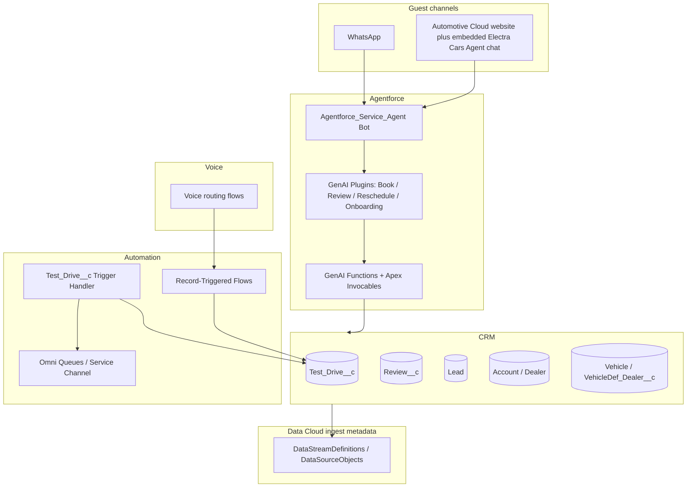

# Technical Design Document (TDD) — Test Drive Agent (Automotive)

**Document purpose:** Describe the solution architecture, functional design, and implementation inventory for the hackathon **Test Drive Agent** project, aligned with the functional flow in *Test Drive Agent (1).pdf* and the metadata and code in this repository.

**Sources of truth:**  
- Functional flow: `Test Drive Agent (1).pdf` (shared flow: Book / Review / Reschedule–Cancel, DL verification, Omni routing, WhatsApp confirmation, Data Cloud for reviews).  
- Implementation: `force-app/main/default/` in this Salesforce DX project.

**Narrative overview (judge-friendly, warranty-style write-up):** `docs/Electra-Cars-Book-Test-Drive-Agent-Solution-Overview.md` — same story as this TDD in continuous prose with hackathon pain-point mapping and a repository quick-reference table.

**Accuracy note:** Anything not present in this repository (for example exact Meta template API names, production Named Credentials, or Salesforce Support case numbers) is **not** asserted here. Those items are documented separately in `03-WhatsApp-Messaging-Supplement.md` as **org / operations narrative** where applicable.

---

## 1. Executive summary

The solution is an **Automotive Cloud–oriented test drive concierge** that combines:

1. **Agentforce / Einstein Service Agent** (`Agentforce_Service_Agent`) with **WhatsApp** and **web / embedded messaging** context mappings so the **same agent** serves messaging and the site.  
2. **Custom Agent actions** implemented as **Apex invocables** and **GenAI Functions** wired for Agent Builder (conversational UX—no custom LWC surface **inside** the agent chat; see §2.4 and §5.6).  
3. **Automotive Cloud–branded public website** (Digital Experience): vehicle marketing and catalog, plus an **embedded Agentforce chat** (“Electra Cars Agent”) so **guests** can get AI guidance and complete **book / review / reschedule / cancel** flows in the browser as well as on WhatsApp.  
4. **Custom objects** for `Test_Drive__c`, `Review__c`, dealer–vehicle availability, and optional `WhatsApp_Message__c` logging.  
5. **Record-triggered automation** on `Test_Drive__c` for **queue routing**, **DL-verified** handling, and **Omni-Channel–related** priorities.  
6. **Flows** for user lifecycle, test drive before-save, and **voice / service agent routing**.  
7. **Data Cloud (Marketing Cloud)** metadata for **Salesforce CRM ingest** of Leads, Test Drives, Reviews, Vehicles, Accounts, etc. (see `04-Data-Cloud-Architecture-and-Flows.md`).  
8. **Prompt Builder integration** via `ElectraAgentTemplateController` calling template API name `Electra_Agent_Template` for AI-generated review summaries (CRM + prompt; Data Cloud usage for summaries is described in the flow PDF and the Data Cloud supplement).

---

## 2. Business problem and scope

### 2.1 Problem

Prospects need a **guided, low-friction path** to book a test drive, verify identity (DL), get **confirmed** appointments, **review** experiences, and **reschedule or cancel**—across **digital messaging** (WhatsApp), a **public Automotive Cloud website** with an embedded agent, and **dealer operations** (queues, verification, same-day rep routing).

### 2.2 In scope (as implemented in repo + flow PDF)

| Area | Description |
|------|-------------|
| Lead capture / lookup | Phone-first identity; create or update Lead; address / ZIP capture. |
| Vehicle selection | List vehicles and models via **agent actions** (and browsing on the **website** catalog where applicable). |
| Dealer match | By vehicle dealing and ZIP; ratings ordering; “coming soon” pincode path. |
| Scheduling | Date (7-day window), time slots, booking summary and confirmation (conversational / data-driven in the agent). |
| DL verification | Upload, pending / failed / verified states; queue handoff. |
| Same-day routing | When test drive date is **today** and status **DL Verified**, route to rep (Omni / flows—see flows inventory). |
| Reviews | Create/update `Review__c`; flow PDF references **insert/upsert to Data Cloud** for analytics. |
| Messaging | WhatsApp + site-embedded agent; messaging channel metadata; agent context variables per message type. |

### 2.3 Out of scope (unless added later)

- Production secrets in source (repo uses placeholders in sample callout classes—see §8).  
- Non-Salesforce mobile apps (hackathon project is Salesforce Platform–native).

### 2.4 Guest channels and UX decision (website vs LWC-in-agent)

**Dual channel:** Guests can use **WhatsApp** or the **Automotive Cloud website**. On the site, the **Electra Cars Agent** is surfaced as a standard **Agentforce** web chat widget (“Ask Me Anything” / “Type your message…”, powered by Agentforce), so users get **AI insights** and transactional flows (**book, review, reschedule, cancel**) without opening WhatsApp.

**Why LWC is not used inside the agent:** An early design considered **Lightning Web Components** for rich “quick option” tiles inside the agent. That approach was **not** adopted for the **agent** itself because **custom LWC renderers do not run inside the WhatsApp messaging surface**; the team standardized on **conversational replies + Apex / GenAI actions** that behave consistently on **WhatsApp and web**. LWCs in this project are used for **site pages and utilities** (vehicle showcase, detail, banners, optional DL upload), not as the in-thread agent UI.

---

## 3. High-level architecture

**Site layer (separate from agent thread):** The website provides marketing and catalog pages (home hero, vehicle grid with filters, vehicle detail, global nav to Test Drive / Contact, login). Those pages may use **LWC-backed Experience Cloud components** for layout and inventory; the **agent** uses the **standard embedded chat** and **does not rely on LWC renderers inside the conversation**.

---

## 4. Functional design (mapped to flow PDF)

### 4.1 Book Test Drive

1. **Entry:** User provides phone (validity check in conversation design).  
2. **Lead:** Lookup by phone; if none, collect name / full address / ZIP; confirm or change ZIP; create or update Lead.  
3. **Vehicle:** Select vehicle → list models → dealer list from **vehicle dealing + ZIP**; handle no-match pincode (agent conversation; user may also browse the **site vehicle catalog** for context).  
4. **Dealer & slot:** Select dealer, date (7 days), and time slots via **agent-guided steps**; confirm summary (disclaimer: subject to DL verification).  
5. **Persistence:** Test drive record created/updated with statuses including **Draft**, **Pending DL Verification**, **DL Verified**, **Test Drive Scheduled**, etc. (see `Status__c` picklist in metadata).  
6. **Notifications:** Flow PDF: WhatsApp confirmation; **live** path uses **Digital Engagement** + templates; repo also contains **unused** Apex Graph/webhook helpers retained from development (see supplement).

### 4.2 Review Test Drive

1. Phone → Lead lookup → list test drives (recent first).  
2. If review exists: update or add; else create `Review__c`.  
3. Flow PDF: **AI summary** of reviews for car and dealer (Prompt Builder + Data Cloud narrative in PDF).  
4. Data Cloud: review and related objects have **ingest metadata** in repo (`Review_c_Home` stream, etc.).

### 4.3 Reschedule / Cancel

1. Phone → Lead → upcoming test drives (exclude in-progress/completed per PDF).  
2. **Cancel:** status → **Cancelled**.  
3. **Reschedule:** new date/slots, summary, update `Test_Drive__c` date/time fields.

### 4.4 DL verification and operations

- States in metadata include **Pending DL Verification**, **DL Verified**, **DL Verification Failed**, **Pending DL**.  
- `TestDriveTriggerHandler` sets **routing priority**, moves records to **Verification** / **Test Drive** queues, and handles **DL Verified** transitions for operational routing.

---

## 5. Component inventory (repository)

### 5.1 Agentforce bot

| Artifact | Path |
|----------|------|
| Bot | `force-app/main/default/bots/Agentforce_Service_Agent/Agentforce_Service_Agent.bot-meta.xml` |
| Bot version | `force-app/main/default/bots/Agentforce_Service_Agent/v1.botVersion-meta.xml` |

**Observed configuration:** `agentType` = `EinsteinServiceAgent`; context variables map **MessagingEndUser** and **MessagingSession** fields for **EmbeddedMessaging** and **WhatsApp** (and other message types as declared in metadata).

### 5.2 Automotive Cloud public website (guest experience)

The solution includes an **Automotive Cloud**–styled **Digital Experience** site used as a **second guest entry point** alongside WhatsApp.

| Area | Description |
|------|-------------|
| **Brand & layout** | Header with Automotive Cloud identity; primary navigation (**Home**, **Vehicles**, **Service & Support**, **Test Drive**, **Contact Us**); search and **Login** for authenticated journeys where enabled. |
| **Home** | Hero campaign (e.g. sales event), promotional copy, primary CTAs (**Learn more**, **Contact us**), and trust cues (certified dealers, limited-time offer, price guarantee). |
| **Vehicles** | Catalog view with category filters (e.g. All, Sedan, SUV, Electric, Hatchback); cards show model, color, fuel/type tags, price, and deep link to detail. |
| **Vehicle detail** | Large imagery, specifications (fuel, type, color), price, highlights, and CTAs such as **Get best offer**—supports consideration before the user opens the agent. |
| **Embedded agent** | **Electra Cars Agent** appears as the standard **Agentforce** web chat experience on the site (e.g. launcher **Ask me anything**), branded as powered by Agentforce. Guests use **natural language** to obtain **AI insights** and run the same **book / review / reschedule / cancel** flows as on WhatsApp. |

Repo-related artifacts for site and messaging include `digitalExperiences/`, `digitalExperienceConfigs/`, `siteDotComSites/`, `EmbeddedServiceConfig/`, and `messagingChannels/Electra_Site_Messaging_channel.messagingChannel-meta.xml` (exact binding is org-specific).

### 5.3 GenAI plugins (topic bundles)

| Plugin | File |
|--------|------|
| Book Test Drive | `genAiPlugins/Book_Test_Drive.genAiPlugin-meta.xml` |
| Review Test Drive | `genAiPlugins/Review_Test_Drive.genAiPlugin-meta.xml` |
| Reschedule or Cancel | `genAiPlugins/Reschedule_or_Cancel_Test_Drive.genAiPlugin-meta.xml` |
| Customer onboarding assistance | `genAiPlugins/Customer_onboarding_Assistance.genAiPlugin-meta.xml` |

### 5.4 GenAI functions (schemas + metadata)

| Function | Folder under `genAiFunctions/` |
|----------|-------------------------------|
| Lookup Lead By Phone | `Lookup_Lead_By_Phone/` |
| Create Lead From Phone And Name | `Create_Lead_From_Phone_And_Name/` |
| Get Electra Quick Options | `Get_Electra_Quick_Options/` |
| Get Test Drive Options | `Get_Test_Drive_Options/` |
| Case Status | `Case_Status/` |

### 5.5 Core Apex (Electra / test drive domain)

Representative classes tied to the agent and scheduling domain (non-exhaustive; full list under `classes/`):

- `ElectraLookupLeadByPhoneAction`, `ElectraCreateLeadAction`  
- `ElectraFetchVehiclesAction`, `ElectraFetchDealersAction`, `ElectraFetchAvailableDatesAction`, `ElectraFetchTimeSlotsAction`  
- `ElectraCreateTestDriveAction`, `ElectraRescheduleTestDriveAction`, `ElectraCancelTestDriveAction`, `ElectraFetchTestDrivesAction`  
- `ElectraFetchReviewAction`, `ElectraSaveReviewAction`  
- `ElectraQuickOptions`, `ElectraQuickOptionsAction`, `ElectraQuickOptionsController`, `GetQuickOptionsRendererAction`  
- `ElectraUploadDLController`, `ElectraUploadDLVFController`, `ElectraTriggerDLUploadRequest`  
- `TestDriveTriggerHandler`, `TestDriveDetailService`, `TestDriveRetrievalService`  
- `DealerRoutingService`, `RoutingPriorityCalculator`, `DealerSkillSetupBatch`, `DealerSkillSetupInvocable`, `DealerSkillCreationBatch`  
- `AgentWorkTriggerHandler`, `VehicleDetailsController`, `VehicleShowcaseController`  
- `ElectraAgentTemplateController` (Prompt Builder: `Electra_Agent_Template`)

### 5.6 Lightning Web Components (site and utilities—not inside agent chat)

The following bundles exist under `force-app/main/default/lwc/`. Per §2.4, they are **not** relied on as **in-conversation renderers** for the Agentforce chat on WhatsApp or the web widget. They support **Experience Cloud site pages**, admin patterns, or **optional** flows (e.g. DL upload) where LWC is appropriate.

| Bundle | Typical use (not agent-thread UI) |
|--------|-----------------------------------|
| `vehicleShowcaseCmp` / `vehicleDetailsCmp` | Vehicle catalog and detail pages on the site |
| `navigationBanner`, `eventBanner` | Site chrome / marketing |
| `electraDLUpload` | Driving-license upload experience where surfaced outside plain chat |
| `agentforceQuickOptions`, `electraQuickOptionsRenderer`, `electraQuickOptionsButtons`, `electraStartupMenu`, `testDriveOptions` | Legacy / alternate UX experiments or internal tooling; **agent production UX** is conversational cross-channel |

### 5.7 Flows

| Flow | File |
|------|------|
| Test Drive Before Save | `flows/Test_Drive_Before_Save.flow-meta.xml` |
| Service Agent Route to Work | `flows/Service_Agent_Route_to_Work.flow-meta.xml` |
| Voice agent route | `flows/voice_agent_route.flow-meta.xml` |
| User After Save | `flows/User_After_Save_Flow.flow-meta.xml` |
| SFDC Record Trigger Test | `flows/SFDC_RecordTrigger_Test.flow-meta.xml` |

### 5.8 Custom objects (primary)

| Object | Purpose |
|--------|---------|
| `Test_Drive__c` | Booking lifecycle, dealer, vehicle, slot, DL, routing priority |
| `Review__c` | Customer reviews linked to test drive / vehicle / account / lead |
| `VehicleDef_Dealer__c` | Dealer availability for vehicle definitions |
| `WhatsApp_Message__c` | Optional log of outbound/inbound messaging attempts |
| `Webhook_Log__c` | Webhook / integration logging |

**`Test_Drive__c` fields (from metadata):** include `Status__c`, `Test_Drive_Date__c`, `Test_Drive_Date_Time__c`, `Test_Drive_Time__c`, `Dealer__c`, `Vehicle__c`, `Vehicle_Definition__c`, `Lead__c`, `Pincdoe__c`, `Routing_Priority__c`, `DL_Number__c`, `DL_Verified_By__c`, `Upload_URL__c`, `Booking_Id__c`, `Model_Number__c`, `VDA__c`, `Slot_Label__c`, etc.

### 5.9 Omni / routing–related metadata (partial)

- `serviceChannels/`, `queueRoutingConfigs/`, `queues/`, `skills/`, `presenceUserConfigs/`, `servicePresenceStatuses/` — present under `force-app/main/default/` for Digital Engagement / routing.

**Dedicated routing TDD:** `docs/05-TDD-Omni-Channel-Routing-Test-Drive.md` — full design for `TestDriveTriggerHandler`, `AgentWorkTriggerHandler`, `RoutingPriorityCalculator`, PSR queue/skills flows, dealer skill batches/invocable, Service Channel secondary priority, and your **routing package.xml** inventory with file paths and test checklist.

---

## 6. Integration and security

### 6.1 WhatsApp: production vs repository-only Apex

**Production path:** WhatsApp in the live solution uses **Salesforce Digital Engagement** with a **Meta-approved** WhatsApp Business number and **messaging templates** (standard session/template messaging)—not custom **Graph API** Apex as the primary integration.

**Repository-only (retained, not used live):** Classes such as `WhatsAppService.cls`, `WhatsAppWebhookHandler.cls`, `WhatsAppDirectAPI.cls`, `WhatsAppFreeFormService.cls`, and `sendFreeFormMessage.cls` were built during development and **remain in the repo** for reference or future use; they are **not** the active production path after Digital Engagement was adopted. Those samples may contain **placeholder** constants (`YOUR_PHONE_NUMBER_ID`, etc.); if ever activated, use **Named Credentials** or protected metadata—not committed secrets.

### 6.2 Data residency and consent

Messaging channel metadata includes **opt-in / double opt-in** automated responses (see `messagingChannels/*.xml`). Operational messaging must follow **Meta** and **Salesforce Digital Engagement** policies.

---

## 7. Testing strategy (TDD in the engineering sense)

| Layer | Approach |
|-------|----------|
| Apex | Existing test classes for community/login controllers; extend coverage for Electra actions and `TestDriveTriggerHandler` bulk scenarios. |
| Agent | Manual test scripts: prompts for Book / Review / Reschedule on **WhatsApp and website**; verify conversational outcomes and **CRM** record field updates. |
| Integrations | Sandbox Named Credential to Graph API (if used) with mock for CI. |
| Data Cloud | Validate stream activation and row counts in Data Cloud workspace (org activity). |

---

## 8. Known limitations (honest)

- **WhatsApp Graph Apex** classes are **not** used on the live path (Digital Engagement + approved number); if enabled later, replace placeholders with **Named Credentials**.  
- **ElectraAgentTemplateController** depends on org prompt template `Electra_Agent_Template` existing with matching input variables.  
- **TestDriveReviewService** contains large commented blocks in the repo copy—verify which invocable surface is active in the org before demo.

---

## 9. Document sequence

0. `Electra-Cars-Book-Test-Drive-Agent-Solution-Overview.md` — **narrative** solution doc (hackathon brief + repo; style similar to sample team warranty write-up).  
1. **This file** — core TDD with diagrams and numbered sections.  
2. `02-Hackathon-Rules-Alignment-and-Submission.md` — official rules mapping and submission checklist.  
3. `03-WhatsApp-Messaging-Supplement.md` — WhatsApp metadata list + org narrative (templates, approvals, Support case).  
4. `04-Data-Cloud-Architecture-and-Flows.md` — Data Cloud ingest diagram and object list.  
5. `05-TDD-Omni-Channel-Routing-Test-Drive.md` — **Omni / queue / PSR / skills** routing TDD and enhanced deploy manifest notes.
