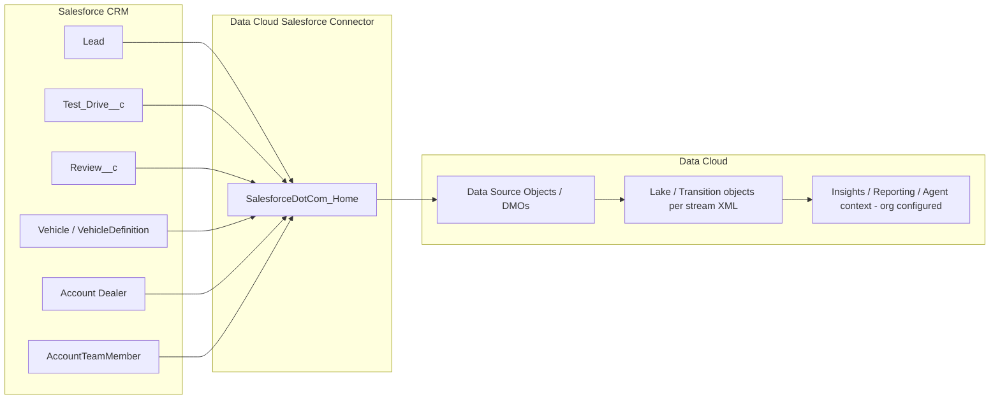
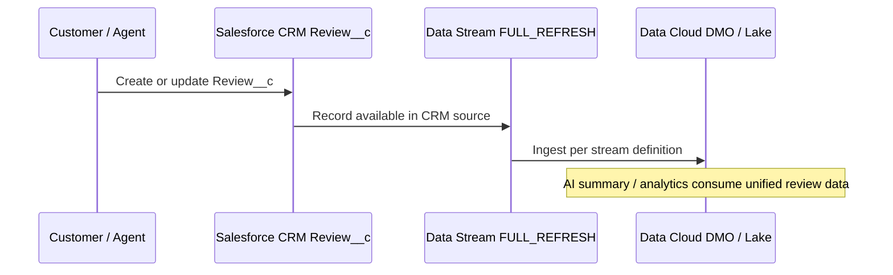

# Data Cloud — Ingest Architecture & Flow Diagrams

**Scope:** This document describes **Salesforce Data Cloud (Marketing Cloud platform)** **ingest metadata** present in the repository: **data stream definitions**, **data source objects**, and related bundle folders. It does **not** describe Calculated Insights, Identity Resolution, or Activation targets unless that metadata is added to the repo later.

**Source alignment:** Your *Test Drive Agent (1).pdf* flow references **insert/upsert to Data Cloud** when reviews are created or updated. In-repo metadata confirms **CRM → Data Cloud lake/transition objects** for `Review__c`, `Test_Drive__c`, and other entities via the **SalesforceDotCom** connector pattern.

---

## 1. Connector pattern (from metadata)

`DataStreamDefinition` files share this structure:

- `dataConnectorType`: **SalesforceDotCom**  
- `dataConnector`: **SalesforceDotCom_Home**  
- `dataSource`: **Salesforce_Home**  
- `dataExtractMethods`: **FULL_REFRESH** (as declared in XML)  
- `mktDataLakeObject` / `mktDataTranObject`: generated **Data Lake / DMO-style** API names (suffix patterns like `__dll` on lake objects in stream definitions)

**Implication:** Data is **pulled from Salesforce CRM** into Data Cloud data lake objects on the cadence configured **in the org** (not visible in static XML).

---

## 2. Data stream definitions in repository

Files under `force-app/main/default/dataStreamDefinitions/`:

| Stream master label | File |
|---------------------|------|
| Account__c | `Account_Home.dataStreamDefinition-meta.xml` |
| AccountTeamMember | `AccountTeamMember_Home.dataStreamDefinition-meta.xml` |
| Asset | `Asset_Home.dataStreamDefinition-meta.xml` |
| Contact | `Contact_Home.dataStreamDefinition-meta.xml` |
| CurrencyType | `CurrencyType_Home.dataStreamDefinition-meta.xml` |
| Lead | `Lead_Home.dataStreamDefinition-meta.xml` |
| Review__c | `Review_c_Home.dataStreamDefinition-meta.xml` |
| Test_Drive__c | `Test_Drive_c_Home.dataStreamDefinition-meta.xml` |
| Vehicle | `Vehicle_Home.dataStreamDefinition-meta.xml` |
| VehicleDefinition | `VehicleDefinition_Home.dataStreamDefinition-meta.xml` |

---

## 3. Data source objects in repository

Files under `force-app/main/default/dataSourceObjects/` include parallel **“Home” / “Home1”** variants for several entities (typical when multiple DMO mappings or bundles exist). Objects covered include:

- Account, AccountTeamMember, Asset, Contact, CurrencyType, Lead  
- **Review__c**, **Test_Drive__c**  
- Vehicle, VehicleDefinition, StaticCurrencyRates  

Use the exact filenames in-repo for the judge appendix.

---

## 4. End-to-end flow (conceptual)

### 4.1 Review journey (ties to flow PDF)

---

## 5. Relationship to Agent / Prompt Builder

- **Ingest** (this doc): makes **Review__c**, **Test_Drive__c**, and related CRM entities available in Data Cloud for analytics and downstream use.  
- **Agent experience** (see TDD): `ElectraAgentTemplateController` invokes **Prompt Builder** template `Electra_Agent_Template` using CRM parameters (Type, Vehicle Model, Account Id, Test Drive Id). Whether the prompt also queries **Data Cloud** objects depends on **how you configured the prompt in the org**—state that only if true in Setup.

---

## 6. Future scope (Data Cloud–specific, honest extensions)

1. **Calculated Insights** on dealer NPS, model-level sentiment, no-show rate by ZIP.  
2. **Identity resolution** between Lead → Contact → Messaging End User.  
3. **Activations** back to Marketing Cloud Journey or WhatsApp **journey** messages (where licensed).  
4. **Streaming** ingest or incremental refresh where supported, to reduce latency vs. full refresh.  
5. **Agentforce grounding** on a **Data Cloud retriever** if product edition permits.

---

## 7. Files to zip for “Data Cloud appendix”

- Entire folders: `dataStreamDefinitions/`, `dataSourceObjects/`, plus any `dataSources/`, `dataSourceTenants/`, `dataPackageKitDefinitions/` if judges need bundle context.
