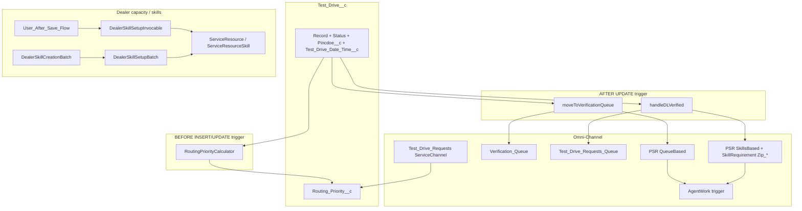

# Technical Design Document — Omni-Channel Routing (`Test_Drive__c`)

**Scope:** Intelligent routing for **test drive requests** using **Omni-Channel**, **Service Channel** (secondary routing priority), **queues**, **PendingServiceRouting (PSR)** (queue-based vs skills-based), **Skill** / **ServiceResource** alignment by **ZIP**, and **AgentWork** lifecycle hooks.

**Sources:** Apex and metadata in `force-app/main/default/`; your **routing package** manifest (API 66.0) listing core deployable units.

**Related docs:** `01-TDD-Test-Drive-Agent.md` (solution-wide); `Electra-Cars-Book-Test-Drive-Agent-Solution-Overview.md` (narrative).

---

## 1. Business objectives

| Objective | Routing behavior |
|-----------|------------------|
| **Reduce manual chase** | When status becomes **Pending DL Verification**, ownership moves to **Verification** queue and a **queue-based PSR** is created so Omni pushes work to verifiers. |
| **ZIP-aware dealership** | After **DL Verified**, if an **active User** exists with `Dealer_Zip__c` matching the test drive **`Pincdoe__c`**, ownership moves to **Test Drive Requests** queue and a **skills-based PSR** targets skill **`Zip_<ZIP>`** (`MostAvailable` routing model). |
| **Urgency** | **Sooner** test drive datetimes get **lower** `Routing_Priority__c` picklist values (1 = first); the **Service Channel** uses this field as **Secondary Routing Priority** so work items sort correctly in the console. |
| **Post-acceptance CRM state** | When a dealer agent **accepts** work from the dealer queue (`AgentWork` **Opened**), `Test_Drive__c.Status__c` advances from **DL Verified** to **Test Drive Scheduled** where applicable. |

---

## 2. High-level routing architecture

---

## 3. Metadata inventory (package-aligned + repo paths)

The table below **extends** your sample `package.xml` with **purpose** and **file location** in this repository.

| Type | Member(s) in package | Purpose | Path / notes |
|------|----------------------|---------|--------------|
| **ApexClass** | `TestDriveTriggerHandler` | Trigger orchestration: priority, queue moves, PSR insert/activate, skills + `SkillRequirement`. | `classes/TestDriveTriggerHandler.cls` |
| **ApexClass** | `AgentWorkTriggerHandler` | On **AgentWork** Opened from verification vs dealer queues; sets **Test Drive Scheduled** for dealer acceptances. | `classes/AgentWorkTriggerHandler.cls` |
| **ApexClass** | `RoutingPriorityCalculator` | Maps **hours until** `Test_Drive_Date_Time__c` → picklist **"1"–"10"** (sooner = lower number). | `classes/RoutingPriorityCalculator.cls` |
| **ApexClass** | `DealerSkillSetupInvocable` | Flow-invoked: ensure **ServiceResource** + **ServiceResourceSkill** for `Zip_<zip>` skills. | `classes/DealerSkillSetupInvocable.cls` |
| **ApexClass** | `DealerSkillSetupBatch` | Batch backfill **ServiceResource** / **ServiceResourceSkill** for users with `Dealer_Zip__c`. | `classes/DealerSkillSetupBatch.cls` |
| **ApexClass** | `DealerSkillCreationBatch` | Aggregate distinct zips from Users; **intended** to insert missing **Skill** rows (setup DML). In repo, `Database.insert(newSkills)` is **commented**—finish chains to `DealerSkillSetupBatch` in `finish()`. | `classes/DealerSkillCreationBatch.cls` — confirm org process for Skill creation (Flow vs batch). |
| **ApexTrigger** | `TestDriveTrigger` | Calls `TestDriveTriggerHandler.execute`. | `triggers/TestDriveTrigger.trigger` |
| **ApexTrigger** | `AgentWorkTrigger` | Calls `AgentWorkTriggerHandler.execute`. | `triggers/AgentWorkTrigger.trigger` |
| **CustomField** | `Test_Drive__c.Routing_Priority__c` | Picklist **1–10**; bound to Service Channel **secondaryRoutingPriorityField**. | `objects/Test_Drive__c/fields/Routing_Priority__c.field-meta.xml` |
| **CustomField** | `User.Dealer_Zip__c` | Dealer rep’s ZIP; used for **skill assignment** and **valid zip** checks before dealer queue move. | `objects/User/fields/Dealer_Zip__c.field-meta.xml` |
| **Flow** | `User_After_Save_Flow` | Record-triggered on **User**; creates/uses **Skill** `Zip_<Dealer_Zip__c>` and invokes **`DealerSkillSetupInvocable`** for **ServiceResource** wiring. | `flows/User_After_Save_Flow.flow-meta.xml` |
| **PresenceUserConfig** | `Test_Drive_Agent_Presence` | Omni **capacity** and push timeout status (`Available_Test_Drives`); assigns **profiles/users** in metadata. | `presenceUserConfigs/Test_Drive_Agent_Presence.presenceUserConfig-meta.xml` |
| **Queue** | `Verification_Queue`, `Test_Drive_Requests_Queue` | DL verification vs dealer-facing work. | `queues/` |
| **QueueRoutingConfig** | `Test_Drive_Routing` | **LEAST_ACTIVE** routing model for test drive queue routing config. | `queueRoutingConfigs/Test_Drive_Routing.queueRoutingConfig-meta.xml` |
| **QueueRoutingConfig** | `Verification_Queue_Config` | **MOST_AVAILABLE** + **pushTimeout** 30s for verification queue. | `queueRoutingConfigs/Verification_Queue_Config.queueRoutingConfig-meta.xml` |
| **ServiceChannel** | `Test_Drive_Requests` | **Related entity** `Test_Drive__c`; **secondaryRoutingPriorityField** = `Routing_Priority__c`; field priorities **1–3** declared for channel sorting. | `serviceChannels/Test_Drive_Requests.serviceChannel-meta.xml` |
| **ServicePresenceStatus** | `Available_Test_Drives` | Presence status referenced by presence config on push timeout. | `servicePresenceStatuses/` |
| **Skill** | `Zip_90210` (example) | One skill per ZIP pattern **`Zip_<postal>`**; package lists sample member—org may contain additional `Zip_*` skills. | `skills/` |

**API version:** Your manifest uses **66.0**; align `sfdx-project.json` / deploy targets accordingly.

---

## 4. Data dependencies

| Field / object | Role |
|----------------|------|
| **`Test_Drive__c.Test_Drive_Date_Time__c`** | Input to `RoutingPriorityCalculator` (minutes until appointment). |
| **`Test_Drive__c.Routing_Priority__c`** | Picklist string **"1"**…**"10"**; Service Channel reads as **secondary routing priority** (ascending: **1** routes ahead of **10**). |
| **`Test_Drive__c.Status__c`** | Drives transitions: e.g. **Pending DL Verification** → verification path; **DL Verified** → dealer path. |
| **`Test_Drive__c.Pincdoe__c`** | Customer ZIP; must be populated for queue moves and for skill name **`Zip_<trim(Pincdoe__c)>`**. |
| **`User.Dealer_Zip__c`** | Must match **`Pincdoe__c`** for `getValidDealerZips` to allow dealer queue assignment; used by `AgentWorkTriggerHandler` when resolving PSR-deleted scenarios. |

**Comment vs code:** `AgentWorkTriggerHandler` Javadoc mentions `Zip_Code__c`; implementation uses **`Pincdoe__c`**—treat **`Pincdoe__c`** as the canonical ZIP field in routing logic.

---

## 5. `TestDriveTriggerHandler` — detailed design

### 5.1 Trigger operations

| Operation | Behavior |
|-----------|----------|
| **BEFORE_INSERT** | Always sets `Routing_Priority__c` via `RoutingPriorityCalculator.calculatePriority(Test_Drive_Date_Time__c)`. Record is not yet queue-owned. |
| **BEFORE_UPDATE** | **`setRoutingPrioritySafe`**: sets priority **only if `OwnerId` is not any Queue** (`Group` where `Type = 'Queue'`). Avoids Salesforce **FIELD_INTEGRITY_EXCEPTION** when Omni locks secondary priority on queue-owned rows. |
| **AFTER_INSERT** | Queue move logic is **commented out** (historical path). |
| **AFTER_UPDATE** | **`moveToVerificationQueue`** then **`handleDLVerified`** inside a **recursion guard** (`isProcessing`). |

### 5.2 Routing priority tiers (`RoutingPriorityCalculator`)

Logic is **time-until** `Test_Drive_Date_Time__c` from `System.now()`, in **minutes**:

| Minutes until | Priority returned |
|---------------|-------------------|
| ≤ 120 (2h) | **1** |
| ≤ 360 | **2** |
| ≤ 720 | **3** |
| ≤ 1440 (24h) | **4** |
| ≤ 2880 (2d) | **5** |
| ≤ 4320 (3d) | **6** |
| ≤ 7200 (5d) | **7** |
| ≤ 10080 (7d) | **8** |
| \> 10080 | **9** |
| null datetime | **10** |

**Service Channel alignment:** `Test_Drive_Requests` service channel lists explicit **serviceChannelFieldPriorities** for values **1–3**; ensure org Omni behavior matches expectations for values **4–10** (metadata may be extended if console requires explicit entries for all picklist values).

### 5.3 Verification path (`moveToVerificationQueue`)

**When:** `Status__c` changes **to** **`Pending DL Verification`**, and **`Pincdoe__c`** is not blank.

**Actions:**

1. **Update** test drive: `OwnerId` → **Verification_Queue**, `Status__c` → **`Requested`**.  
2. **`createQueueBasedPSR`**: For each row, insert `PendingServiceRouting` with `RoutingType = 'QueueBased'`, `ServiceChannelId` from `ServiceChannel` where `RelatedEntity = 'Test_Drive__c'`, `WorkItemId = Test_Drive__c.Id`, `CapacityWeight = 1`, `IsReadyForRouting = false` then flip to **true** on successful insert (two-step activation pattern).

If queue id or channel id is missing, handler logs an **ERROR** and skips.

### 5.4 Dealer path (`handleDLVerified`)

**When:** `Status__c` changes **to** **`DL Verified`**, and **`Pincdoe__c`** is not blank.

**ZIP validation:** `getValidDealerZips` queries **active Users** where `Dealer_Zip__c IN :zipCodes`. If **no** dealers match ZIP, **no** queue move or PSR (WARN debug).

**Actions for valid ZIPs:**

1. **Update** `OwnerId` → **Test_Drive_Requests_Queue** (dealer queue).  
2. **`createSkillsBasedPSR`**:  
   - Skill developer name = **`Zip_` + trim(`Pincdoe__c`)**.  
   - Deletes existing `PendingServiceRouting` for those work items (cleanup before skills routing).  
   - Inserts PSR with `RoutingType = 'SkillsBased'`, `RoutingModel = 'MostAvailable'`, same channel id.  
   - Inserts **`SkillRequirement`** rows (`SkillLevel = 1`) linking PSR → `Skill.Id`.  
   - Sets `IsReadyForRouting = true` on success.

---

## 6. `AgentWorkTriggerHandler` — post-acceptance CRM update

**When:** `AgentWork` **AFTER_INSERT / AFTER_UPDATE**, status **`Opened`**, and **transition** into Opened (not already Opened on update).

**Queues:** Uses `TestDriveTriggerHandler.getQueueMap()` for **Verification_Queue** and **Test_Drive_Requests_Queue** ids.

| Original queue | `WorkItemId` prefix | Effect |
|----------------|---------------------|--------|
| **Verification** | Test Drive key prefix | **No auto status change** (manual verification in agent/UI). |
| **Dealer** | Test Drive id | Direct map to test drive for scheduling update. |
| **Dealer** | PSR key prefix | Resolve `PendingServiceRouting` → underlying `Test_Drive__c` id; if PSR already deleted, **`resolveByDealerZip`**: match agent `User.Dealer_Zip__c` to `Test_Drive__c.Pincdoe__c`, `Status__c = DL Verified`, `OwnerId` = accepting agent. |

**Update:** For resolved test drives in **DL Verified**, set **`Status__c` → `Test Drive Scheduled`** (`STATUS_SCHEDULED` constant).

---

## 7. Dealer skill provisioning

**Goal:** Omni **skills-based** routing requires **`Skill`** rows named **`Zip_<postal>`** and **ServiceResource** / **ServiceResourceSkill** linking each **dealer User** to their zip skill.

| Component | Role |
|-----------|------|
| **`User_After_Save_Flow`** | On User save, ensures skill exists (Flow sub-elements) and calls **`DealerSkillSetupInvocable.setupDealerSkills`** with `userId`, `newZip`, `oldZip`. **Validate** in Setup that invocable inputs map to **`$Record.Id`**, **`$Record.Dealer_Zip__c`**, **`$Record__Prior.Dealer_Zip__c`** (not User Id into zip fields). |
| **`DealerSkillSetupInvocable`** | Creates/updates **ServiceResource** for user and **ServiceResourceSkill** for new zip; removes old zip assignment when zip changes. |
| **`DealerSkillSetupBatch`** | Backfill for existing users with `Dealer_Zip__c` (batch size 50 in docs). |
| **`DealerSkillCreationBatch`** | Aggregates zips; **intended** to insert `Skill` records—**confirm** whether `Database.insert(newSkills)` is enabled in your deployment branch or Skills are created only via Flow. |

**Example skill:** Package lists **`Zip_90210`** — pattern is **`Zip_` + postal code**.

---

## 8. Service channel and queue routing configs

- **`Test_Drive_Requests` service channel:** `relatedEntityType = Test_Drive__c`, **`secondaryRoutingPriorityField = Routing_Priority__c`**. Omni uses this to order work among same-priority queue configurations where applicable.  
- **`Test_Drive_Routing`:** `routingModel = LEAST_ACTIVE`, `routingPriority = 1`.  
- **`Verification_Queue_Config`:** `routingModel = MOST_AVAILABLE`, `pushTimeout = 30`, `routingPriority = 1`.

**Deployment:** Queues must be linked to these **QueueRoutingConfig** records in Omni **Routing Configuration** setup (org UI)—metadata declares configs; **queue–config association** is completed in the org.

---

## 9. Presence

**`Test_Drive_Agent_Presence`:** Defines **capacity** (e.g. 1), sound flags, and **`presenceStatusOnPushTimeout`** → **`Available_Test_Drives`**. Profile/user assignments live in metadata—**update** for production users (avoid shipping personal emails in shared repos where possible).

---

## 10. Error handling and observability

- **`TestDriveTriggerHandler.logDmlErrors`**: Uses `Database.update` / `insert` with **`allOrNone = false`** and logs **ERROR** per failed row for queue moves and PSR DML.  
- Missing queue or service channel: **early return** + debug ERROR (silent skip—monitor debug logs in sandbox).  
- Missing **Skill** for a ZIP: skills-based PSR path logs **WARN** and skips skill requirement creation for that zip.

---

## 11. Testing checklist

| # | Test |
|---|------|
| 1 | Insert test drive with future `Test_Drive_Date_Time__c` → `Routing_Priority__c` matches calculator table. |
| 2 | Transition to **Pending DL Verification** with `Pincdoe__c` set → owner **Verification_Queue**, status **Requested**, **QueueBased** PSR exists and becomes ready. |
| 3 | Active user with matching `Dealer_Zip__c` → transition to **DL Verified** → owner **Test_Drive_Requests_Queue**, **SkillsBased** PSR + **SkillRequirement** for `Zip_<zip>`. |
| 4 | **DL Verified** with ZIP **no** active dealer user → no dealer queue move (verify WARN / no partial update). |
| 5 | **AgentWork** Opened from dealer queue → `Test_Drive__c` becomes **Test Drive Scheduled** when starting from **DL Verified**. |
| 6 | Update test drive while **queue-owned** → priority field **not** rewritten (no FIELD_INTEGRITY). |
| 7 | User `Dealer_Zip__c` change → Flow + invocable maintain **ServiceResourceSkill** alignment. |

---

## 12. Deployment manifest (enhanced sample)

Your **original** minimal `package.xml` (classes, triggers, two custom fields, User flow, presence, queues, queue routing configs, service channel, presence status, one sample skill) is **valid** for a focused deploy.

**Enhanced manifest in repo:** `manifest/routing-package-enhanced.xml` — same core members, plus:

- **Flows:** `Service_Agent_Route_to_Work`, `voice_agent_route`, `Test_Drive_Before_Save` (routing-adjacent automation in this project).  
- **Skills:** all current **`Zip_*`** skills retrieved in the repo (`Zip_90210`, `Zip_84060`, `Zip_12345`).

Trim or extend **Skill** `<members>` to match zips you actually use in production. Add additional **`CustomField`** entries (e.g. `Test_Drive__c.Pincdoe__c`, `Test_Drive__c.Status__c`) if you deploy fields separately from the full object.

Keep **`DealerSkillCreationBatch`** insert behavior aligned with how **Skill** records are created in your org (Flow-only vs batch DML).

---

## 13. Known gaps / follow-ups

1. **`DealerSkillCreationBatch`**: Confirm whether **Skill** `insert` should be uncommented for environments without Flow-based Skill creation.  
2. **`User_After_Save_Flow`**: Reconcile invocable **input mappings** with `DealerSkillSetupInvocable.FlowInput` (`userId`, `newZip`, `oldZip`).  
3. **Service channel priorities:** Metadata only encodes priorities **1–3**; validate Omni ordering for priorities **4–10** in a full sandbox.  
4. **Javadoc:** Align `AgentWorkTriggerHandler` comments with **`Pincdoe__c`** field API name.

---

*This TDD is derived from the current repository. Org-specific Omni console steps (work routing rules, queue membership, supervisor settings) may extend beyond retrieved metadata.*
